# Timeline: Both Projects Visualization

> **Last Updated**: 2025-11-17
> **Current Position**: Starting Project 2 (Template Unification)

---

## Visual Timeline

```
┌─────────────────────────────────────────────────────────────────────────────┐
│                        PROJECT TIMELINE VISUALIZATION                       │
└─────────────────────────────────────────────────────────────────────────────┘

2025-11-16 (Yesterday)
│
├─● Project 1 Started: TinyMath Questions Migration
│  │
│  ├─✅ Phase 1: Infrastructure & Pipeline (COMPLETE)
│  │   ├─ Created converter script
│  │   ├─ Built test pipeline
│  │   ├─ Added color template system
│  │   └─ Validated with sample questions
│  │
│  └─⏸️ Phase 2: Import Core Questions (STARTED)
│      └─ ⚠️ BLOCKED: Syntax issue discovered
│
│
2025-11-17 Morning
│
├─● Discovery: Converter outputs wrong syntax
│  ├─ Converter: %{variable}
│  └─ Questions: {{variable}} expected
│
├─● Decision: Pause Project 1, Fix syntax first
│
│
2025-11-17 Current ← 🔴 YOU ARE HERE
│
├─● Project 2 Started: Template Syntax Unification
│  │
│  ├─□ Step 1: Delete seed questions (5 min)
│  │   └─ Next immediate action
│  │
│  ├─□ Step 2: Fix converter script (30 min)
│  │   └─ Change %{var} → {{var}}
│  │
│  ├─□ Step 2: Update Shared library (30 min)
│  │   └─ Unify on {{variable}} syntax
│  │
│  ├─□ Step 4: Test everything (15 min)
│  │   └─ Verify all components work
│  │
│  └─□ Step 5: Document & commit (10 min)
│
│
2025-11-17 Later Today (~2 hours from now)
│
├─● Project 2 Complete
│
├─● Resume Project 1: Phase 2
│  │
│  ├─□ Import 895 core questions
│  ├─□ Validate with correct syntax
│  └─□ Test question rendering
│
│
2025-11-17/18 (Next 1-2 days)
│
├─● Project 1: Phase 3
│  ├─□ Import 560 MathLive questions
│  └─□ Test MathLive integration
│
├─● Project 1: Phase 4
│  ├─□ Import 223 advanced questions
│  ├─□ Full validation
│  └─□ Final verification
│
│
2025-11-18+
│
└─● Both Projects Complete
   ├─ 2,238 questions migrated
   ├─ Single syntax throughout
   └─ Ready for production
```

---

## Detailed Status Breakdown

### Project 1: TinyMath Migration (PAUSED)

```
Phase 1 [████████████████████] 100% ✅ COMPLETE
Phase 2 [███░░░░░░░░░░░░░░░░]  15% ⏸️ PAUSED (syntax issue)
Phase 3 [░░░░░░░░░░░░░░░░░░░]   0% ⏹️ NOT STARTED
Phase 4 [░░░░░░░░░░░░░░░░░░░]   0% ⏹️ NOT STARTED
```

### Project 2: Template Unification (ACTIVE)

```
Planning    [████████████████████] 100% ✅ COMPLETE
Step 1      [░░░░░░░░░░░░░░░░░░░]   0% 🔄 NEXT
Step 2      [░░░░░░░░░░░░░░░░░░░]   0% ⏹️ QUEUED
Step 3      [░░░░░░░░░░░░░░░░░░░]   0% ⏹️ QUEUED
Step 4      [░░░░░░░░░░░░░░░░░░░]   0% ⏹️ QUEUED
Step 5      [░░░░░░░░░░░░░░░░░░░]   0% ⏹️ QUEUED
```

---

## Time Estimates

### Project 2 (Current Focus)
| Step | Duration | Cumulative |
|------|----------|------------|
| Delete seed questions | 5 min | 5 min |
| Fix converter | 30 min | 35 min |
| Update Shared | 30 min | 65 min |
| Test everything | 15 min | 80 min |
| Document & commit | 10 min | 90 min |
| **TOTAL** | **1.5 hours** | - |

### Project 1 (After Project 2)
| Phase | Questions | Duration | Cumulative |
|-------|-----------|----------|------------|
| Phase 2 (resume) | 895 | 2 hours | 2 hours |
| Phase 3 | 560 | 2 hours | 4 hours |
| Phase 4 | 223 | 1 hour | 5 hours |
| **TOTAL** | **1,678** | **5 hours** | - |

### Combined Timeline
- **Project 2**: 1.5 hours (TODAY)
- **Project 1**: 5 hours (TODAY/TOMORROW)
- **Total**: ~6.5 hours of work

---

## Key Milestones

### ✅ Completed
- [2025-11-16] Project 1 Phase 1: Infrastructure ready
- [2025-11-17] Syntax issue discovered
- [2025-11-17] Optimized plan created

### 🔄 In Progress
- [2025-11-17] Project 2: Template unification

### 📅 Upcoming
- [Today +2h] Project 2 complete
- [Today +4h] Project 1 Phase 2 complete
- [Tomorrow] Project 1 Phase 3 complete
- [Tomorrow] Project 1 Phase 4 complete

---

## Critical Path

```mermaid
graph LR
    A[P2: Delete Seeds] -->|5min| B[P2: Fix Converter]
    B -->|30min| C[P2: Update Shared]
    C -->|30min| D[P2: Test]
    D -->|15min| E[P2: Complete]
    E -->|Resume| F[P1: Phase 2]
    F -->|2h| G[P1: Phase 3]
    G -->|2h| H[P1: Phase 4]
    H -->|1h| I[Migration Complete]

    style A fill:#f9f,stroke:#333,stroke-width:4px
    style E fill:#9f9,stroke:#333,stroke-width:2px
    style I fill:#9ff,stroke:#333,stroke-width:2px
```



---

## Recovery Checkpoints

### If Session Crashes During Project 2
1. Check: Are seed questions deleted?
   - Yes → Continue with converter fix
   - No → Start with seed deletion
2. Check: Is converter fixed?
   - Yes → Continue with Shared update
   - No → Fix converter
3. Check: Is Shared updated?
   - Yes → Run tests
   - No → Update Shared

### If Session Crashes During Project 1 (after Project 2)
1. Verify Project 2 complete (syntax unified)
2. Check migration progress in `.claude/migration-progress.md`
3. Resume from last completed batch

---

## Command Reference

### Project 2 Commands (Current)
```bash
# Step 1: Delete seeds
pnpm supabase db reset  # or manual SQL

# Step 2: Fix converter
pnpm test scripts/tinymce-to-ubumaths-converter.test.js

# Step 3: Update Shared
pnpm test:unit template-engine

# Step 4: Full test
pnpm test:unit
pnpm check:fast
```

### Project 1 Commands (After Project 2)
```bash
# Resume Phase 2
node scripts/tinymce-to-ubumaths-converter.js \
  --input data/exports/tinymce_questions_core.json \
  --mode import

# Continue with Phase 3, 4...
```

---

**Current Action Required**: Start Project 2 Step 1 - Delete seed questions

**See Also**:
- `.claude/PROJECT-OVERVIEW-2025-11-17.md` for master overview
- `.claude/DECISION-LOG-2025-11-17.md` for reasoning