# Stores Architecture - UbuMaths

Guide complet de l'architecture des stores Svelte 5.

---

## Dependency Diagram

```mermaid
graph TB
    subgraph Infrastructure["Infrastructure Layer"]
        auth[auth.svelte.ts<br/>Session & User]
        supabaseRT[supabaseRealtime.svelte.ts<br/>Channel Manager]
        toaster[toaster.svelte.ts<br/>Notifications UI]
    end

    subgraph UI["UI State"]
        theme[theme.svelte.ts<br/>Dark/Light Mode]
        fontSize[fontSize.svelte.ts<br/>Font Scaling]
        modalStack[modalStack.svelte.ts<br/>Modal Navigation]
    end

    subgraph Context["Teacher Context"]
        selectedClass[selectedClass.svelte.ts<br/>Class Selection]
        selectedPeriod[selectedPeriod.svelte.ts<br/>Period Selection]
    end

    subgraph Cache["Dashboard Caches"]
        teacherCache[teacherDashboardCache<br/>933 lines - TTL-based]
        studentCache[studentDashboardCache<br/>TTL-based]
    end

    subgraph Communication["Communication"]
        chat[chat.svelte.ts<br/>Hybrid Realtime]
        privateMsg[privateMessages.svelte.ts<br/>Inbox/Sent/Drafts]
        notifications[notifications.svelte.ts<br/>Notification Center]
        notifRT[notificationsRealtime<br/>postgres_changes]
    end

    subgraph Social["Social"]
        friends[friends.svelte.ts<br/>Friend Management]
        presence[presence.svelte.ts<br/>Online Status]
    end

    subgraph Gamification["Gamification"]
        achievements[achievements.svelte.ts<br/>Cache + Toast Queue]
        achieveRT[achievementsRealtime<br/>Unlock Events]
        rewardJournal[rewardJournal.svelte.ts<br/>History + Filters]
        shop[shop.svelte.ts<br/>Item Store]
        marketplace[marketplace.svelte.ts<br/>Student Market]
    end

    subgraph Games["Games & Tools"]
        multiplayer[multiplayer.svelte.ts<br/>Matchmaking]
        minesweeper[minesweeper.svelte.ts<br/>Single Player]
        notebook[notebookStore.svelte.ts<br/>Python IDE]
        python[pythonPlayground<br/>Code Execution]
        blockly[blocklyPlayground<br/>Visual Programming]
    end

    subgraph Content["Content"]
        questionCart[questionCart.svelte.ts<br/>Exercise Builder]
        vipCards[vipCardTemplates<br/>Card Templates]
    end

    %% Dependencies
    supabaseRT --> chat
    supabaseRT --> presence
    supabaseRT --> notifRT
    supabaseRT --> achieveRT

    auth --> chat
    auth --> friends
    auth --> presence

    presence --> friends

    notifications --> notifRT
    achievements --> achieveRT

    selectedClass --> teacherCache
    selectedPeriod --> teacherCache

    toaster -.-> chat
    toaster -.-> privateMsg
    toaster -.-> achievements
    toaster -.-> multiplayer
```



---

## Store Categories

### 1. Infrastructure (Foundation)

| Store              | Purpose                                   | Persistence |
| ------------------ | ----------------------------------------- | ----------- |
| `auth`             | Session and user data from Supabase       | Memory      |
| `supabaseRealtime` | Centralized Realtime channel manager      | Memory      |
| `toaster`          | Toast notification facade (svelte-sonner) | None        |

### 2. UI State

| Store        | Purpose                      | Persistence  |
| ------------ | ---------------------------- | ------------ |
| `theme`      | Dark/light mode toggle       | CSS/Window   |
| `fontSize`   | Font scaling 75%-150%        | localStorage |
| `modalStack` | Stack-based modal navigation | Memory       |

### 3. Teacher Context

| Store            | Purpose                            | Persistence  |
| ---------------- | ---------------------------------- | ------------ |
| `selectedClass`  | Currently selected class           | localStorage |
| `selectedPeriod` | Currently selected academic period | localStorage |

### 4. Dashboard Caches

| Store                   | Purpose                              | TTL                        |
| ----------------------- | ------------------------------------ | -------------------------- |
| `teacherDashboardCache` | Classes, students, rewards, warnings | 2h students, 10min rewards |
| `studentDashboardCache` | Student-specific data                | Variable                   |

### 5. Communication

| Store                   | Purpose                       | Realtime                     |
| ----------------------- | ----------------------------- | ---------------------------- |
| `chat`                  | Full chat system (hybrid)     | Broadcast + postgres_changes |
| `privateMessages`       | Private messaging with drafts | None                         |
| `notifications`         | Notification center           | Via notificationsRealtime    |
| `notificationsRealtime` | INSERT/UPDATE events          | postgres_changes             |
| `activity`              | Aggregates unread counts      | None                         |

### 6. Social

| Store      | Purpose                 | Realtime                          |
| ---------- | ----------------------- | --------------------------------- |
| `friends`  | Friendship management   | None (uses presence)              |
| `presence` | Online/offline tracking | postgres_changes (180s heartbeat) |

### 7. Gamification

| Store                  | Purpose                            | Realtime                 |
| ---------------------- | ---------------------------------- | ------------------------ |
| `achievements`         | Achievement tracking + toast queue | Via achievementsRealtime |
| `achievementsRealtime` | Unlock events                      | postgres_changes         |
| `rewardJournal`        | Reward history with filters        | None                     |
| `shop`                 | Admin shop management              | None                     |
| `marketplace`          | Student marketplace                | None                     |
| `vipCardTemplates`     | VIP card definitions               | None                     |

### 8. Games & Tools

| Store               | Purpose                      | Realtime       |
| ------------------- | ---------------------------- | -------------- |
| `multiplayer`       | Minesweeper matchmaking      | Direct channel |
| `minesweeper`       | Single-player game state     | None           |
| `notebookStore`     | Python notebook with cells   | None (DB save) |
| `pythonPlayground`  | Python execution environment | None           |
| `blocklyPlayground` | Blockly visual programming   | None           |
| `repl`              | Python REPL shell            | None           |
| `grapheur`          | Graph plotting tool          | None           |

### 9. Content

| Store                | Purpose                   | Persistence  |
| -------------------- | ------------------------- | ------------ |
| `questionCart`       | Question selection cart   | localStorage |
| `questionTemplates`  | Question template library | None         |
| `questionCategories` | Category taxonomy         | None         |
| `messageTemplates`   | Message template library  | None         |
| `hashtags`           | Hashtag autocomplete      | None         |
| `mentions`           | User mention autocomplete | None         |

---

## Architectural Patterns

### Pattern 1: Lazy localStorage Initialization

```typescript
// Used by: selectedClass, selectedPeriod, fontSize, questionCart
class Store {
	private initialized = false;
	private value = $state<string | null>(null);

	private init() {
		if (this.initialized || typeof window === 'undefined') return;
		this.value = localStorage.getItem('key');
		this.initialized = true;
	}

	get id(): string | null {
		this.init();
		return this.value;
	}
}
```

### Pattern 2: Realtime with Reconnection

```typescript
// Used by: chat, presence, achievementsRealtime
class RealtimeStore {
	private reconnectAttempts = 0;
	private readonly MAX_ATTEMPTS = 5;

	private async reconnect() {
		if (this.reconnectAttempts >= this.MAX_ATTEMPTS) return;

		const delay = Math.pow(2, this.reconnectAttempts) * 1000;
		await new Promise((r) => setTimeout(r, delay));
		this.reconnectAttempts++;

		await this.subscribe();
	}
}
```

### Pattern 3: Dual Subscription (Chat)

```typescript
// Broadcast: FREE, 50ms latency, ephemeral
// postgres_changes: QUOTA, 300ms latency, persistent

// Flow:
// 1. User sends message
// 2. OPTIMISTIC: Add to local array
// 3. BROADCAST: Send via Broadcast (50ms)
// 4. DB: Insert to database
// 5. POSTGRES_CHANGES: Replace with full data
```

### Pattern 4: Zod Validation on Realtime

```typescript
// Used by: chat, multiplayer, achievementsRealtime
const eventSchema = z.object({
	type: z.literal('message'),
	payload: z.object({
		id: z.string().uuid(),
		content: z.string()
	})
});

channel.on('broadcast', { event: 'message' }, (payload) => {
	const result = eventSchema.safeParse(payload);
	if (!result.success) return; // Ignore malformed
	handleMessage(result.data.payload);
});
```

### Pattern 5: Cache with TTL

```typescript
// Used by: achievements (5min), teacherDashboardCache
class CachedStore {
	private cache = new Map<string, { data: T; timestamp: number }>();
	private readonly TTL = 5 * 60 * 1000; // 5 minutes

	get(key: string): T | null {
		const entry = this.cache.get(key);
		if (!entry) return null;
		if (Date.now() - entry.timestamp > this.TTL) {
			this.cache.delete(key);
			return null;
		}
		return entry.data;
	}
}
```

### Pattern 6: Optimistic Updates

```typescript
// Used by: notifications, chat, friends
async function updateItem(id: string, data: Partial<Item>) {
	// 1. Save original
	const original = this.items.find((i) => i.id === id);

	// 2. Optimistic update
	this.items = this.items.map((i) => (i.id === id ? { ...i, ...data } : i));

	try {
		await api.update(id, data);
	} catch {
		// 3. Rollback on error
		this.items = this.items.map((i) => (i.id === id ? original : i));
	}
}
```

---

## Key Design Decisions

### 1. No Auto-Polling

Stores don't automatically refetch data. Manual refresh required.

**Why**: Reduces Supabase quota usage. Users control data freshness.

### 2. 180-Second Heartbeat (Presence)

`HEARTBEAT_INTERVAL = 180000` (3 minutes)

**Why**: Supabase free tier has 200 concurrent connections. Frequent heartbeats exhaust quota quickly.

### 3. Broadcast + postgres_changes Hybrid (Chat)

- Broadcast: FREE, doesn't count toward quota
- postgres_changes: Reliable but limited

**Why**: Best UX (50ms delivery) with reliable persistence.

### 4. Toast Queue Max Size

`MAX_TOASTS = 10` with FIFO eviction

**Why**: Rapid achievement unlocks could exhaust memory.

### 5. Singleton Export Pattern

```typescript
class StoreName {
	/* ... */
}
export const storeName = new StoreName();
```

**Why**: Single source of truth, consistent across components.

---

## Usage Guide

### When to Use Which Store

| Need                          | Store                                   |
| ----------------------------- | --------------------------------------- |
| Show toast notification       | `toaster.success('Message')`            |
| Check current user            | `auth.user`                             |
| Teacher's selected class      | `selectedClassStore().id`               |
| Real-time chat                | `chatStore.sendMessage()`               |
| Check friend online status    | `presenceManager.getFriendPresence(id)` |
| Show achievement unlock       | `achievementsStore.showUnlockToast()`   |
| Build exercise from questions | `questionCart.addToCart()`              |

### Store Lifecycle

1. **Import**: `import { storeName } from '$lib/stores/storeName.svelte'`
2. **Use in component**: Access via `storeName.property` or `storeName.method()`
3. **Cleanup**: Most stores auto-cleanup. For Realtime stores, call `.destroy()` in `onDestroy`

### Creating New Stores

Follow these conventions:

1. File: `src/lib/stores/newStore.svelte.ts`
2. Use `$state()` for reactive properties
3. Use `$derived` getters for computed values
4. Export singleton instance
5. Add JSDoc comments
6. Add to this documentation

---

## File Reference

```
src/lib/stores/
├── auth.svelte.ts              # Authentication
├── theme.svelte.ts             # Dark mode
├── fontSize.svelte.ts          # Font scaling
├── modalStack.svelte.ts        # Modal navigation
├── toaster.svelte.ts           # Toast notifications
├── selectedClass.svelte.ts     # Teacher context
├── selectedPeriod.svelte.ts    # Teacher context
├── teacherDashboardCache.svelte.ts  # 933 lines - needs split?
├── studentDashboardCache.svelte.ts
├── chat.svelte.ts              # Hybrid realtime
├── privateMessages.svelte.ts
├── notifications.svelte.ts
├── notificationsRealtime.svelte.ts
├── activity.svelte.ts
├── friends.svelte.ts
├── presence.svelte.ts
├── supabaseRealtime.svelte.ts  # Channel manager
├── achievements.svelte.ts
├── achievementsRealtime.svelte.ts
├── rewardJournal.svelte.ts
├── shop.svelte.ts
├── marketplace.svelte.ts
├── vipCardTemplates.svelte.ts
├── multiplayer.svelte.ts
├── minesweeper.svelte.ts
├── notebookStore.svelte.ts
├── pythonPlayground.svelte.ts
├── blocklyPlayground.svelte.ts
├── repl.svelte.ts
├── grapheur.svelte.ts
├── questionCart.svelte.ts
├── questionTemplates.svelte.ts
├── questionCategories.svelte.ts
├── messageTemplates.svelte.ts
├── hashtags.svelte.ts
├── mentions.svelte.ts
├── exerciseFont.svelte.ts
├── holo-card.svelte.ts
├── listNumbering.svelte.ts
├── test-mode.svelte.ts
└── game/
    ├── player.svelte.ts
    ├── combat.svelte.ts
    ├── challenge.svelte.ts
    └── spells.svelte.ts
```

---

_Last updated: 2025-12-16_
