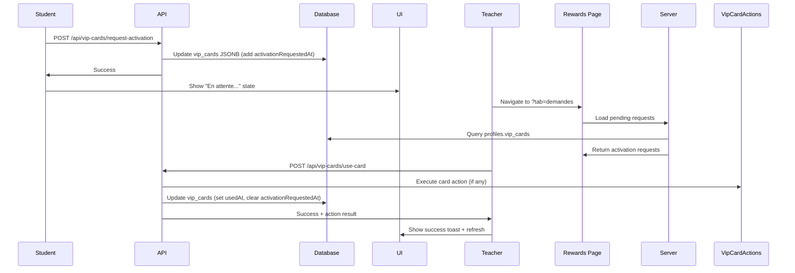
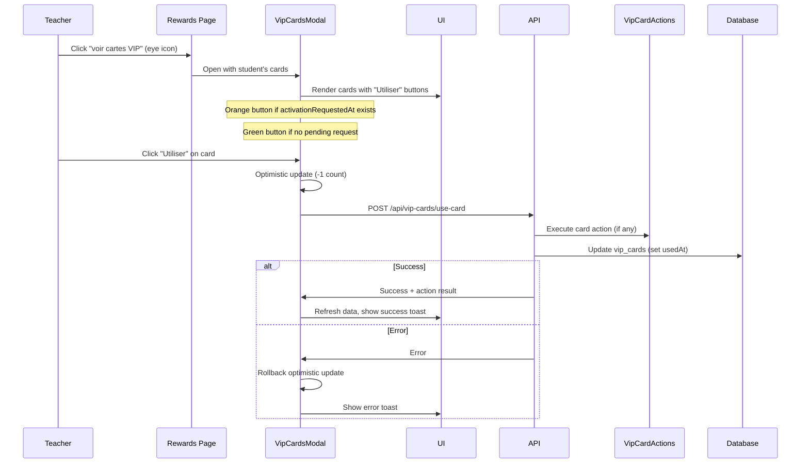

# VIP Card Activation & Usage System

Complete documentation for the unified VIP card activation and usage system.

**Status**: ✅ Production
**Version**: 2.1.0
**Last Updated**: 2025-11-04

---

## 🆕 Changelog

### Version 2.2.0 (2025-11-06)

**Optimistic UI for VIP Card Actions**

- Fixed bug where used VIP card wasn't removed from UI until page refresh
- Added `usedCardInstanceId` prop to `VipCardDrawModal` to track consumed card
- Modal now marks used card as consumed in cache optimistically: `usedAt: new Date().toISOString()`
- Used card disappears immediately from `VipCardsModal` after draw_cards action
- Matches backend behavior where draw-cards API atomically marks card as used
- Also applies to exchange_cards and remove_warnings actions

**Technical Changes**:

- Updated `VipCardDrawModal.svelte`: Added `usedCardInstanceId` prop and optimistic update logic
- Updated `VipCardsModal.svelte`: Pass `usedCardInstanceId` when opening draw modal
- Updated `vip-card-modals.ts`: Added `usedCardInstanceId` to `DrawCardsOptions` interface

---

### Version 2.1.0 (2025-11-04)

**Cache Synchronization for Award VIP Card**

- Modified `award_random_vip_card` RPC function to return JSONB instead of TEXT
- Now returns complete card information: `{ cardId, instanceId, earnedAt }`
- Enables instant cache synchronization when cards are drawn
- VIP cards now appear immediately in "Voir Cartes" modal without page refresh
- Maintains dramatic card reveal animation
- Backward compatible with older frontends

**Technical Changes**:

- Migration: `20251104005641_modify_award_vip_card_return_jsonb.sql`
- Updated API: `/api/teacher/rewards/award-vip-card` response format
- Frontend: `rewards/+page.svelte` now updates cache after card draw (lines 353-367)

---

## 📚 Table of Contents

- [Overview](#overview)
- [Architecture](#architecture)
- [Workflows](#workflows)
- [API Reference](#api-reference)
- [UI Components](#ui-components)
- [Data Model](#data-model)
- [Security](#security)
- [Testing](#testing)

---

## Overview

The VIP card activation system allows teachers to manage student VIP card usage with instant visual feedback through optimistic UI updates. All VIP card actions (draw_cards, exchange_cards, remove_warnings, add_gidouilles) immediately update the cache and UI before server confirmation.

### Two Workflows

### 🎯 Workflow 1: Student Request → Teacher Approval

1. Student requests activation from their dashboard
2. Request appears in teacher's "Demandes d'activation VIP" tab
3. Teacher approves → card consumed + action executed

### 🎯 Workflow 2: Direct Teacher Activation

1. Teacher opens student's VIP modal from rewards page
2. Teacher clicks "Utiliser" button (green or orange if pending request)
3. Card consumed + action executed (prioritizes instances with pending requests)

### Key Features

- ✅ **Unified endpoint**: Single `/api/vip-cards/use-card` for both workflows
- ✅ **Complete optimistic UI**: All VIP card actions update cache instantly
- ✅ **Automatic rollback**: Errors revert optimistic updates automatically
- ✅ **Priority system**: Instances with pending requests used first
- ✅ **Visual indicators**: Orange icon for pending requests, green for available
- ✅ **URL-based tabs**: Bookmarkable teacher dashboard with Gidouilles/Demandes tabs
- ✅ **Centralized management**: All reward features in `/dashboard/teacher/rewards`

---

## Optimistic UI Pattern

All VIP card actions follow a consistent optimistic UI pattern for instant feedback:

### Pattern Overview

```
1. User triggers action (click "Utiliser")
   ↓
2. OPTIMISTIC UPDATE: Modify cache immediately
   ├─> Mark card as used: vipCards[instanceId].usedAt = new Date()
   ├─> Add new cards/gidouilles to cache
   └─> UI updates instantly (card disappears, counts change)
   ↓
3. BACKGROUND SYNC: Send API request
   ├─> Server validates and executes action
   └─> Response confirms changes
   ↓
4a. SUCCESS: Keep optimistic changes
    └─> Show success toast

4b. ERROR: Rollback optimistic changes
    ├─> Restore previous cache state
    └─> Show error toast
```

### Action-Specific Patterns

#### 1. draw_cards Action

**Optimistic Updates:**

- Mark used card as consumed: `usedAt: new Date().toISOString()`
- Add newly drawn cards to cache with `usedAt: null`

**Implementation:**

```typescript
// VipCardDrawModal.svelte (lines 149-159)
if (paymentMethod === 'vip_card' && usedCardInstanceId) {
	updatedVipCards[usedCardInstanceId] = {
		...updatedVipCards[usedCardInstanceId],
		usedAt: new Date().toISOString() // Mark as used immediately
	};
}

// Add new cards
for (const card of result.cards) {
	updatedVipCards[card.instanceId] = {
		cardId: card.cardId,
		earnedAt: card.earnedAt,
		usedAt: null // New cards are unused
	};
}

teacherCache.updateVipCardsOptimistic(classId, studentId, updatedVipCards);
```

**User Experience:**

- Used card disappears from VipCardsModal immediately
- New cards appear with correct counts instantly
- No page refresh needed

---

#### 2. exchange_cards Action

**Optimistic Updates:**

- Mark used card as consumed
- Add newly received card to cache

**Implementation:**

```typescript
// Similar to draw_cards, but typically exchanges 1 card for 1 card
// Backend API marks original card as used and adds new card atomically
```

**User Experience:**

- Original card disappears immediately
- New card appears with count increment
- Seamless card transformation

---

#### 3. remove_warnings Action

**Optimistic Updates:**

- Mark used card as consumed
- Warnings removal happens on backend (not in VIP card cache)

**Implementation:**

```typescript
// Modal marks card as used in cache
// API removes warnings from student record
// No warnings in VIP cards cache to update
```

**User Experience:**

- Card disappears immediately
- Warning count updates after API response
- Teacher sees immediate feedback

---

#### 4. add_gidouilles Action

**Optimistic Updates:**

- Mark used card as consumed
- Update gidouilles balance immediately

**Implementation:**

```typescript
// VipCardsModal.svelte (line 315)
teacherCache.updateGidouillesOptimistic(classId, studentId, action.amount);

// Mark card as used
await markCardAsUsed(instanceId, cardName);
```

**User Experience:**

- Card disappears immediately
- Gidouilles counter increments instantly
- Smooth, responsive UX

---

### Rollback Pattern

When errors occur, all optimistic updates are reverted:

```typescript
// VipCardsModal.svelte (lines 366-370)
catch (err) {
  // Rollback optimistic update
  teacherCache.updateVipCardsOptimistic(classId, studentId, previousVipCards);
  const message = err instanceof Error ? err.message : 'Erreur inconnue';
  toaster.error(message);
}
```

**Guarantees:**

- User never sees inconsistent state
- Cache always matches backend after error
- Clear error messaging via toasts
- No manual refresh needed

---

### Cache Synchronization

The `teacherDashboardCache` provides methods for optimistic updates:

```typescript
// Update VIP cards (atomic replacement)
teacherCache.updateVipCardsOptimistic(
  classId: string,
  studentId: string,
  vipCards: StudentVipCards
): void

// Update gidouilles (add/subtract)
teacherCache.updateGidouillesOptimistic(
  classId: string,
  studentId: string,
  delta: number  // Can be positive or negative
): void
```

**Cache Behavior:**

- Updates persist until next cache invalidation
- TTL: 5 minutes by default
- Manual invalidation via `invalidateAll()`
- Automatic invalidation on route changes

---

### Testing Optimistic UI

**Manual Testing Checklist:**

1. **Successful Flow:**
   - [ ] Click "Utiliser" on card with action
   - [ ] Card disappears immediately from modal
   - [ ] New cards/gidouilles appear instantly
   - [ ] No page refresh needed
   - [ ] Toast notification shows success

2. **Error Flow:**
   - [ ] Simulate network error (DevTools offline)
   - [ ] Click "Utiliser" on card
   - [ ] Card disappears initially (optimistic)
   - [ ] Card reappears after error (rollback)
   - [ ] Error toast displays
   - [ ] No inconsistent state visible

3. **Race Conditions:**
   - [ ] Quickly click "Utiliser" twice on same card
   - [ ] First click succeeds
   - [ ] Second click fails with "already used" error
   - [ ] UI shows card used only once

**Automated Testing:**

See `tests/integration/vip-card-optimistic-ui.test.ts` for complete test suite covering:

- Optimistic updates for all action types
- Rollback scenarios
- Cache synchronization
- Race condition handling

---

## Architecture

### Simplified Data Model (v2.0.0)

**Changed from v1.0.0**: Removed redundant `activatedAt` and `activatedBy` fields.

```typescript
interface VipCardInstance {
	cardId: string; // Card type ID (e.g., "bonus", "captain")
	earnedAt: string; // ISO timestamp
	usedAt: string | null; // ISO timestamp when consumed
	activationRequestedAt?: string | null; // Student request timestamp
	activationRequestedBy?: string | null; // Student ID who requested
}
```

**Rationale**: Cards are "consumed" regardless of whether they trigger actions. Using a single `usedAt` field simplifies the model and avoids confusion between "used" and "activated" states.

### File Structure

```
src/
├── routes/
│   ├── api/
│   │   └── vip-cards/
│   │       └── use-card/
│   │           └── +server.ts                    # Unified endpoint
│   └── (protected)/
│       └── dashboard/
│           └── teacher/
│               └── rewards/
│                   ├── +page.server.ts           # Load activation requests
│                   └── +page.svelte              # Tabs: Gidouilles + Demandes
├── lib/
│   ├── components/
│   │   ├── VipCard.svelte                        # "Utiliser" button
│   │   └── VipCardsModal.svelte                  # Direct teacher activation
│   ├── server/
│   │   └── vip-card-actions.ts                   # Execute card actions
│   ├── types/
│   │   └── vip-card.ts                           # VipCardInstance type
│   └── utils/
│       └── vip-cards.ts                          # Helper functions
```

### Centralized Architecture

All VIP card management happens in `/dashboard/teacher/rewards`:

**Tab 1: Gidouilles** (default)

- Student list with gidouille counters
- Quick actions: +/- gidouilles, view VIP cards, add VIP card

**Tab 2: Demandes d'activation VIP** (`?tab=demandes`)

- Table of pending activation requests
- Columns: Student, Card, Action, Requested Date
- Actions: Utiliser (approve) / Rejeter (reject)

**URL-based Navigation**:

```
/dashboard/teacher/rewards                  → Gidouilles tab
/dashboard/teacher/rewards?tab=demandes     → Activation requests tab
```

---

## Workflows

### Workflow 1: Student Request → Teacher Approval



**Key Points**:

- Student can request activation from their dashboard (future feature)
- Teacher sees requests in dedicated "Demandes" tab
- Clicking "Utiliser" consumes the card and executes its action
- Request automatically cleared when card used

### Workflow 2: Direct Teacher Activation



**Key Points**:

- Teacher clicks eye icon next to student in rewards table
- Modal shows all student's VIP cards with counts (×3, ×2, etc.)
- "Utiliser" button instantly decrements count (optimistic UI)
- Prioritizes instances with pending activation requests
- Rollback on error (count restored)

---

## API Reference

### POST /api/teacher/rewards/award-vip-card

Award a random VIP card to a student (costs 3 gidouilles).

**Authentication**: Required (teacher or admin)

**Request Body**:

```typescript
{
	studentId: string; // UUID of the student
}
```

**Validation** (Zod):

```typescript
const schema = z.object({
	studentId: z.string().uuid()
});
```

**Response** (Success):

```typescript
{
	success: true,
	message: "Carte VIP attribuée avec succès !",
	cardId: string,        // Card type (e.g., "bonus", "captain")
	instanceId: string,    // UUID of created instance
	earnedAt: string       // ISO timestamp
}
```

**Response** (Error):

```typescript
{
	message: string; // Error description
}
```

**Status Codes**:

| Code | Reason                                                |
| ---- | ----------------------------------------------------- |
| 200  | Success                                               |
| 400  | Invalid request body / Insufficient gidouilles        |
| 401  | Not authenticated                                     |
| 403  | Not teacher/admin OR student not in teacher's classes |
| 500  | Server error (database or RPC failure)                |

**Security**:

- Zod validation on request body
- Teacher-student relationship verified via RLS in RPC function
- Atomic database transaction (gidouilles deducted and card added together)
- Minimum gidouilles check (student must have at least 3)

**Cache Synchronization** (2025-11-04):

The endpoint returns complete card information enabling instant cache updates:

```typescript
const response = await fetch('/api/teacher/rewards/award-vip-card', {
	method: 'POST',
	body: JSON.stringify({ studentId })
});

const result = await response.json();

// Immediately update cache with new card
if (result.instanceId && result.earnedAt) {
	const rewards = teacherCache.getRewardsSync(selectedClassId);
	const currentVipCards = rewards?.get(studentId)?.vip_cards || {};

	teacherCache.updateVipCardsOptimistic(selectedClassId, studentId, {
		...currentVipCards,
		[result.instanceId]: {
			cardId: result.cardId,
			earnedAt: result.earnedAt,
			usedAt: null
		}
	});
}
```

**Benefits**:

- VIP cards appear immediately in "Voir Cartes" modal
- No page refresh required
- Maintains dramatic card reveal animation
- Backward compatible with older frontends

**Migration Note** (2025-11-04):

The underlying `award_random_vip_card` RPC function was modified to return JSONB instead of TEXT, enabling this cache synchronization pattern. See migration `20251104005641_modify_award_vip_card_return_jsonb.sql`.

---

### POST /api/vip-cards/use-card

Unified endpoint for consuming VIP cards (with or without actions).

**Authentication**: Required (teacher or admin)

**Request Body**:

```typescript
{
	instanceId: string; // UUID of the VIP card instance
	studentId: string; // UUID of the student
}
```

**Validation** (Zod):

```typescript
const useCardSchema = z.object({
	instanceId: z.string().uuid('Invalid instance ID format'),
	studentId: z.string().uuid('Invalid student ID format')
});
```

**Response** (Success):

```typescript
{
  success: true,
  message: "Card used successfully",
  cardName: string,
  actionResult?: {
    // Varies by action type
    drawnCards?: { cardId: string; name: string }[],
    warningsRemoved?: number,
    gidouillesAdded?: number,
    // etc.
  }
}
```

**Response** (Error):

```typescript
{
	message: string; // Error description
}
```

**Status Codes**:
| Code | Reason |
|------|--------|
| 200 | Success |
| 400 | Invalid request body / Card already used |
| 401 | Not authenticated |
| 403 | Not teacher/admin OR student not in teacher's classes |
| 404 | Card instance not found / Card definition not found |
| 500 | Server error (database or action execution failed) |

**Security**:

- ✅ Zod validation on request body
- ✅ Teacher-student relationship verified via `class_members` table
- ✅ Card instance existence and usability checked
- ✅ Atomic JSONB update (no race conditions)
- ✅ Action execution failures properly handled

**Example Usage**:

```typescript
const response = await fetch('/api/vip-cards/use-card', {
	method: 'POST',
	headers: { 'Content-Type': 'application/json' },
	body: JSON.stringify({ instanceId, studentId })
});

if (!response.ok) {
	const { message } = await response.json();
	throw new Error(message);
}

const result = await response.json();
console.log(result.cardName, result.actionResult);
```

**Replaces** (v1.0.0):

- ❌ `POST /api/vip-cards/approve-activation` (merged into use-card)
- ❌ `POST /api/vip-cards/reject-activation` (no longer needed)
- ❌ `POST /api/vip-cards/request-activation` (kept for student requests)

---

## UI Components

### VipCard Component

**File**: `src/lib/components/VipCard.svelte`

**New Props** (v2.0.0):

```typescript
interface Props {
	card: VipCard;
	count?: number;
	isFlipped?: boolean;
	size?: 'sm' | 'md' | 'lg';
	clickable?: boolean;
	onclick?: () => void;
	showRemoveButton?: boolean; // Teacher: trash icon
	onRemove?: () => void;
	showUseButton?: boolean; // NEW: Teacher use card
	hasPendingRequest?: boolean; // NEW: Orange vs green indicator
	onUse?: () => void; // NEW: Callback when used
}
```

**Use Button States**:

1. **Available (Green)**: Card has action, not used, no pending request
   - Green background (`bg-green-600`)
   - Sparkles icon
   - Label: "Utiliser cette carte"

2. **Pending Request (Orange)**: Card has action, not used, pending request exists
   - Orange background (`bg-orange-500`)
   - Clock icon
   - Label: "Demande en attente"

3. **Hidden**: Card has no action OR card already used
   - Button not rendered

**Template**:

```svelte
{#if showUseButton && card.action}
  <button
    type="button"
    class={cn(
      'absolute left-2 bottom-2 rounded-full p-2 shadow-lg transition-all hover:scale-110 active:scale-95',
      hasPendingRequest
        ? 'bg-orange-500 hover:bg-orange-600 text-white'
        : 'bg-green-600 hover:bg-green-700 text-white',
      size === 'sm' ? 'p-1.5' : size === 'md' ? 'p-2' : 'p-2.5'
    )}
    onclick={handleUse}
    aria-label={hasPendingRequest ? 'Demande en attente' : 'Utiliser cette carte'}
  >
    {#if hasPendingRequest}
      <Clock class={/* size */} />
    {:else}
      <Sparkles class={/* size */} />
    {/if}
  </button>
{/if}
```

### VipCardsModal Component

**File**: `src/lib/components/VipCardsModal.svelte`

**New Features** (v2.0.0):

1. **Optimistic Used Counts**:

```typescript
let optimisticUsedCounts = $state<Record<string, number>>({});
```

2. **Priority-Based Instance Selection**:

```typescript
function findInstanceToUse(cardId: string): string | null {
	const entries = Object.entries(vipCards);

	// Priority 1: Instance with pending request
	const withRequest = entries.find(
		([_, inst]) => inst.cardId === cardId && !inst.usedAt && inst.activationRequestedAt
	);
	if (withRequest) return withRequest[0];

	// Priority 2: First available instance
	const available = entries.find(([_, inst]) => inst.cardId === cardId && !inst.usedAt);
	return available?.[0] || null;
}
```

3. **Optimistic UI with Rollback**:

```typescript
async function handleUseCard(card: { id: string; name: string }) {
	if (!teacherView || !studentId) return;

	const instanceId = findInstanceToUse(card.id);
	if (!instanceId) {
		toaster.error('Aucune instance disponible');
		return;
	}

	// STEP 1: Optimistic update
	optimisticUsedCounts = {
		...optimisticUsedCounts,
		[card.id]: (optimisticUsedCounts[card.id] || 0) + 1
	};

	try {
		// STEP 2: Server request
		const response = await fetch('/api/vip-cards/use-card', {
			method: 'POST',
			headers: { 'Content-Type': 'application/json' },
			body: JSON.stringify({ instanceId, studentId })
		});

		const result = await response.json();
		if (!response.ok) throw new Error(result.message);

		// STEP 3: Success
		toaster.success(`Carte ${card.name} utilisée !`);
		await invalidateAll();
	} catch (error) {
		// STEP 4: Error - Rollback
		const newCount = Math.max(0, (optimisticUsedCounts[card.id] || 0) - 1);
		if (newCount === 0) {
			const { [card.id]: _, ...rest } = optimisticUsedCounts;
			optimisticUsedCounts = rest;
		} else {
			optimisticUsedCounts = { ...optimisticUsedCounts, [card.id]: newCount };
		}
		toaster.error("Échec de l'utilisation");
	}
}
```

4. **Derived Counts** (accounts for both removals and uses):

```typescript
const cardsWithCounts = $derived(
	sortCardsByPriority(getStudentCardsWithCounts(vipCards))
		.map((card) => {
			const removedCount = optimisticRemovedCounts[card.id] || 0;
			const usedCount = optimisticUsedCounts[card.id] || 0;
			return {
				...card,
				count: Math.max(0, card.count - removedCount - usedCount)
			};
		})
		.filter((card) => card.count > 0)
);
```

5. **Cleanup Effect** (reset on modal close):

```typescript
$effect(() => {
	if (!open) {
		optimisticRemovedCounts = {};
		optimisticUsedCounts = {};
	}
});
```

### Teacher Rewards Page

**File**: `src/routes/(protected)/dashboard/teacher/rewards/+page.svelte`

**New Features** (v2.0.0):

1. **URL-based Tabs**:

```typescript
import { page } from '$app/state';
import { goto } from '$app/navigation';

let activeTab = $derived(page.url.searchParams.get('tab') || 'gidouilles');

function changeTab(tab: string) {
	const url =
		tab === 'gidouilles' ? '/dashboard/teacher/rewards' : `/dashboard/teacher/rewards?tab=${tab}`;
	goto(url, { replaceState: false });
}
```

2. **Demandes Tab**:

```svelte
<Tabs.Content value="demandes">
	{#if data.activationRequests.length === 0}
		<Card.Root>
			<Card.Content class="pt-6 text-center">
				<Sparkles class="mx-auto mb-4 h-12 w-12 text-muted-foreground" />
				<p class="text-lg text-muted-foreground">Aucune demande d'activation en attente</p>
			</Card.Content>
		</Card.Root>
	{:else}
		<Card.Root>
			<Card.Header>
				<Card.Title class="flex items-center justify-between">
					<span>Demandes en attente</span>
					<Badge variant="secondary">{data.activationRequests.length}</Badge>
				</Card.Title>
			</Card.Header>
			<Card.Content>
				<Table.Root>
					<Table.Header>
						<Table.Row>
							<Table.Head>Élève</Table.Head>
							<Table.Head>Carte</Table.Head>
							<Table.Head>Action</Table.Head>
							<Table.Head>Demandée le</Table.Head>
							<Table.Head class="text-right">Actions</Table.Head>
						</Table.Row>
					</Table.Header>
					<Table.Body>
						{#each data.activationRequests as request}
							<Table.Row>
								<Table.Cell>{request.studentName}</Table.Cell>
								<Table.Cell>
									<Badge variant="secondary">{request.cardName}</Badge>
								</Table.Cell>
								<Table.Cell class="text-sm text-muted-foreground">
									{request.actionDescription}
								</Table.Cell>
								<Table.Cell>
									{new Date(request.requestedAt).toLocaleDateString('fr-FR', {
										day: '2-digit',
										month: '2-digit',
										year: 'numeric',
										hour: '2-digit',
										minute: '2-digit'
									})}
								</Table.Cell>
								<Table.Cell class="text-right">
									<div class="flex justify-end gap-2">
										<Button size="sm" onclick={() => handleUseCard(request)}>Utiliser</Button>
										<Button size="sm" variant="outline" onclick={() => handleReject(request)}>
											Rejeter
										</Button>
									</div>
								</Table.Cell>
							</Table.Row>
						{/each}
					</Table.Body>
				</Table.Root>
			</Card.Content>
		</Card.Root>
	{/if}
</Tabs.Content>
```

**Server Load** (`+page.server.ts`):

```typescript
export const load: PageServerLoad = async ({ locals }) => {
	const { user } = await requireRole(locals, 'teacher');
	const supabase = locals.supabase;

	// Get all students that this teacher teaches
	const { data: classMembers } = await supabase
		.from('class_members')
		.select('student_id, classes!inner(teacher_id)')
		.eq('classes.teacher_id', user.id);

	const studentIds = Array.from(new Set(classMembers?.map((cm) => cm.student_id) || []));
	if (studentIds.length === 0) {
		return { activationRequests: [] };
	}

	// Fetch profiles with vip_cards
	const { data: profiles } = await supabase
		.from('profiles')
		.select('id, firstname, lastname, vip_cards')
		.in('id', studentIds);

	// Extract pending activation requests from JSONB
	const activationRequests: ActivationRequest[] = [];
	profiles?.forEach((profile) => {
		const vipCards = (profile.vip_cards || {}) as unknown as StudentVipCards;
		const studentName = `${profile.firstname || ''} ${profile.lastname || ''}`.trim();

		Object.entries(vipCards).forEach(([instanceId, instance]) => {
			if (instance.activationRequestedAt && !instance.usedAt) {
				const cardDef = getVipCardById(instance.cardId);
				if (cardDef && cardDef.action) {
					activationRequests.push({
						studentId: profile.id,
						studentName: studentName || 'Élève',
						instanceId,
						cardId: instance.cardId,
						cardName: cardDef.name,
						actionDescription: getActionDescription(cardDef.action),
						requestedAt: instance.activationRequestedAt
					});
				}
			}
		});
	});

	// Sort by requested date (most recent first)
	activationRequests.sort(
		(a, b) => new Date(b.requestedAt).getTime() - new Date(a.requestedAt).getTime()
	);

	return { activationRequests };
};
```

---

## Data Model

### VipCardInstance Type

```typescript
export interface VipCardInstance {
	cardId: string; // Card type ID (e.g., "bonus", "captain")
	earnedAt: string; // ISO timestamp when earned
	usedAt: string | null; // ISO timestamp when consumed (null = unused)
	activationRequestedAt?: string | null; // Student request timestamp (optional)
	activationRequestedBy?: string | null; // Student ID who requested (optional)
}
```

### VipCard Definition

```typescript
export interface VipCard {
	id: string; // Unique card ID
	name: string; // Display name (French)
	description: string; // Card description
	imagePath: string; // Path to card image
	category: VipCardCategory;
	rarity?: VipCardRarity; // 'common' | 'rare' | 'epic' | 'legendary'
	action?: VipCardAction; // Optional action when used
}

type VipCardAction =
	| DrawCardsAction
	| RemoveWarningsAction
	| ExchangeCardsAction
	| AddGidouillesAction;
```

### Storage Format (JSONB in profiles.vip_cards)

```json
{
	"uuid-instance-1": {
		"cardId": "bonus",
		"earnedAt": "2025-11-03T10:00:00Z",
		"usedAt": null,
		"activationRequestedAt": "2025-11-03T12:00:00Z",
		"activationRequestedBy": "student-uuid"
	},
	"uuid-instance-2": {
		"cardId": "captain",
		"earnedAt": "2025-11-02T15:00:00Z",
		"usedAt": "2025-11-03T14:00:00Z"
	}
}
```

---

## Security

### Authentication & Authorization

1. **Endpoint Protection**:
   - All endpoints require authentication via `requireAuth()` middleware
   - Teacher/admin role verification
   - Student-teacher relationship verified via `class_members` join

2. **Input Validation** (Zod):

```typescript
const useCardSchema = z.object({
	instanceId: z.string().uuid('Invalid instance ID format'),
	studentId: z.string().uuid('Invalid student ID format')
});
```

3. **Business Logic Checks**:
   - Card instance exists
   - Card not already used
   - Card definition exists
   - Teacher teaches the student

### Atomic Updates

```typescript
// BEFORE: Race condition possible
const vipCards = await getVipCards(studentId);
vipCards[instanceId].usedAt = new Date().toISOString();
await updateVipCards(studentId, vipCards);

// AFTER: Atomic JSONB update
await supabase
	.from('profiles')
	.update({
		vip_cards: {
			...vipCards,
			[instanceId]: { ...vipCards[instanceId], usedAt: new Date().toISOString() }
		} as never
	})
	.eq('id', studentId);
```

### Error Handling

1. **Graceful Failures**:
   - Action execution errors don't prevent card consumption
   - Detailed error logging with context
   - User-friendly error messages

2. **Rollback Strategy**:
   - Optimistic UI rolls back on errors
   - No partial state updates
   - Toast notifications for all outcomes

---

## Testing

### Unit Tests

**File**: `tests/unit/vip-card-activation.test.ts`

```typescript
describe('VipCardActivation', () => {
	test('findInstanceToUse prioritizes pending requests', () => {
		const vipCards = {
			'uuid-1': { cardId: 'bonus', usedAt: null, activationRequestedAt: null },
			'uuid-2': { cardId: 'bonus', usedAt: null, activationRequestedAt: '2025-11-03T10:00:00Z' }
		};

		const instanceId = findInstanceToUse('bonus', vipCards);
		expect(instanceId).toBe('uuid-2'); // Pending request prioritized
	});

	test('optimistic UI rollback on error', async () => {
		const modal = new VipCardsModal({ studentId, vipCards, teacherView: true });

		await modal.handleUseCard({ id: 'bonus', name: 'Bonus' });
		expect(modal.optimisticUsedCounts['bonus']).toBe(1); // Optimistic update

		// Simulate error
		fetchMock.mockReject(new Error('Network error'));

		await modal.handleUseCard({ id: 'bonus', name: 'Bonus' });
		expect(modal.optimisticUsedCounts['bonus']).toBe(0); // Rollback
	});
});
```

### Integration Tests

**Scenarios**:

- ✅ Student requests activation → Teacher approves → Card consumed + action executed
- ✅ Teacher directly uses card → Optimistic update → Server sync → Success
- ✅ Teacher directly uses card with pending request → Request cleared
- ✅ Error during action execution → Card still consumed, error logged
- ✅ Network error during use → Optimistic update rolled back

### E2E Tests

**File**: `tests/e2e/vip-card-activation.spec.ts`

```typescript
test('complete activation workflow', async ({ page }) => {
	// Login as teacher
	await page.goto('/dashboard/teacher/rewards');

	// Navigate to Demandes tab
	await page.click('button:has-text("Demandes d\'activation VIP")');

	// Verify pending request appears
	await expect(page.locator('td:has-text("Super Bonus")')).toBeVisible();

	// Click Utiliser
	await page.click('button:has-text("Utiliser")');

	// Verify success toast
	await expect(page.locator('.toast:has-text("utilisée")')).toBeVisible();

	// Verify request removed from list
	await expect(page.locator('td:has-text("Super Bonus")')).not.toBeVisible();
});
```

---

## Migration Guide (v1.0.0 → v2.0.0)

### Breaking Changes

1. **Removed Fields**:
   - ❌ `VipCardInstance.activatedAt` → Use `usedAt` instead
   - ❌ `VipCardInstance.activatedBy` → Not needed

2. **Removed Endpoints**:
   - ❌ `POST /api/vip-cards/approve-activation` → Use `use-card` instead
   - ❌ `POST /api/vip-cards/reject-activation` → No longer needed

3. **Removed Pages**:
   - ❌ `/teacher/vip-cards/+page.svelte` → Merged into `/teacher/rewards?tab=demandes`

### Migration Steps

1. **Update API Calls**:

```typescript
// BEFORE (v1.0.0)
await fetch('/api/vip-cards/approve-activation', {
	method: 'POST',
	body: JSON.stringify({ instanceId, studentId })
});

// AFTER (v2.0.0)
await fetch('/api/vip-cards/use-card', {
	method: 'POST',
	body: JSON.stringify({ instanceId, studentId })
});
```

2. **Update Navigation Links**:

```typescript
// BEFORE
<a href="/teacher/vip-cards">Cartes VIP</a>

// AFTER
<a href="/dashboard/teacher/rewards?tab=demandes">Demandes d'activation VIP</a>
```

3. **Update VipCard Component Usage**:

```svelte
<!-- BEFORE -->
<VipCard {card} showActivationButton={true} />

<!-- AFTER -->
<VipCard
	{card}
	showUseButton={teacherView}
	hasPendingRequest={cardHasPendingRequest(card.id)}
	onUse={() => handleUseCard(card)}
/>
```

---

## Future Enhancements

### Planned Features

- 📝 **Student-initiated requests**: Allow students to request card activation from their dashboard
- 📝 **Notifications**: Notify teachers when new activation requests arrive
- 📝 **Batch approval**: Approve multiple requests at once
- 📝 **Request history**: View past activation requests with timestamps
- 📝 **Action preview**: Show action details before approval
- 📝 **Custom actions**: Allow teachers to define custom card actions
- 📝 **Usage statistics**: Track which cards are used most frequently

### Performance Optimizations

- 🔄 **Real-time updates**: Use Supabase subscriptions instead of polling
- 🔄 **Pagination**: Paginate activation requests for large class sizes
- 🔄 **Caching**: Cache card definitions client-side
- 🔄 **Lazy loading**: Load card images only when visible

---

**Last Updated**: 2025-11-03
**Maintainer**: UbuMaths Team
**Status**: ✅ Production-ready

---

[← Back to Rewards Documentation](./rewards/README.md)
