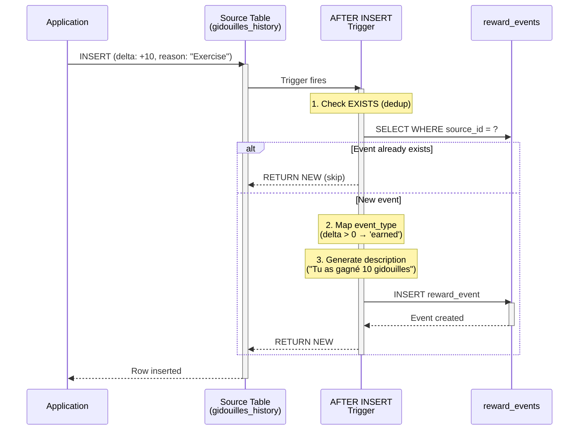
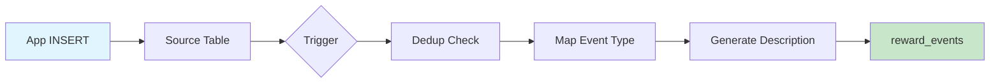

# Audit Trail System - Technical Reference

> Complete technical documentation for the UbuMaths audit trail system.

## Overview

The UbuMaths audit trail system provides comprehensive activity tracking across the platform. It follows a **multi-layered architecture**:

1. **Source Audit Tables** - Individual tables tracking specific activities
2. **Unified Audit View** - The `reward_events` table aggregating all reward-related events
3. **Specialized Audit Tables** - Domain-specific auditing (moderation, templates, errors)

## Architecture Diagram

```
┌─────────────────────────────────────────────────────────────────────────────┐
│                           Source Tables (Write)                              │
├─────────────────┬─────────────────┬─────────────────┬──────────────────────┤
│ gidouilles_     │ bonus_          │ vip_cards_      │ shop_purchase_       │
│ history         │ history         │ activity        │ history              │
├─────────────────┼─────────────────┼─────────────────┼──────────────────────┤
│ student_        │ item_usage_     │ marketplace_    │                      │
│ achievements    │ log             │ trades          │                      │
└────────┬────────┴────────┬────────┴────────┬────────┴──────────┬───────────┘
         │                 │                 │                   │
         │    AFTER INSERT TRIGGERS (SECURITY DEFINER)          │
         │                 │                 │                   │
         └────────────────┬┴─────────────────┴───────────────────┘
                          │
                          ▼
┌─────────────────────────────────────────────────────────────────────────────┐
│                        reward_events (Unified Read)                          │
│  - Single table for all reward-related audit queries                        │
│  - Human-readable French descriptions                                        │
│  - Indexed for student journal, teacher view, analytics                     │
└─────────────────────────────────────────────────────────────────────────────┘

┌─────────────────────────────────────────────────────────────────────────────┐
│                      Specialized Audit Tables                                │
├─────────────────────────┬───────────────────────┬───────────────────────────┤
│ template_audit_log      │ moderation_logs       │ error_logs                │
│ (message templates)     │ (chat moderation)     │ (error monitoring)        │
└─────────────────────────┴───────────────────────┴───────────────────────────┘
```

## Event Flow Sequence



### Simplified Flow



## Key Features

| Feature               | Implementation                                                               |
| --------------------- | ---------------------------------------------------------------------------- |
| **Automatic Logging** | Database triggers ensure all events are captured                             |
| **Deduplication**     | EXISTS checks and unique indexes prevent duplicates                          |
| **Human-Readable**    | Auto-generated French descriptions via `generate_reward_event_description()` |
| **Role-Based Access** | RLS policies for students, teachers, and admins                              |
| **Full Traceability** | `source_table` + `source_id` link back to original records                   |
| **Performance**       | Strategic indexes for common query patterns                                  |

## Documentation Index

| Document                                                | Description                                                  |
| ------------------------------------------------------- | ------------------------------------------------------------ |
| [Database Schema](./database-schema.md)                 | Complete table definitions, columns, indexes, and enum types |
| [Triggers & Functions](./triggers-functions.md)         | Database triggers and helper functions                       |
| [API Reference](./api-reference.md)                     | REST endpoints for querying audit data                       |
| [Frontend Integration](./frontend-integration.md)       | Svelte components, stores, and UI patterns                   |
| [Security Model](./security-model.md)                   | RLS policies and access control rules                        |
| [Troubleshooting](./troubleshooting.md)                 | Common issues, diagnostic queries, and solutions             |
| [Extending the Audit Trail](./extending-audit-trail.md) | Guide for adding new audit sources and event types           |
| [Performance](./performance.md)                         | Index strategy, query optimization, archiving, and scaling   |
| [Testing](./testing.md)                                 | Unit tests, integration tests, and RLS policy testing        |

## Quick Reference

### Audit Table Categories

#### Reward System (Unified in `reward_events`)

| Source Table            | Events Tracked                                   |
| ----------------------- | ------------------------------------------------ |
| `gidouilles_history`    | Currency earned, spent, traded, awarded, removed |
| `bonus_history`         | Bonus points earned, used                        |
| `vip_cards_activity`    | Cards gained, used, removed, traded              |
| `student_achievements`  | Achievements unlocked                            |
| `shop_purchase_history` | Items purchased                                  |
| `item_usage_log`        | Items used, effects applied                      |
| `marketplace_trades`    | P2P trading activity                             |

#### Specialized Auditing

| Table                | Domain            | Events Tracked                    |
| -------------------- | ----------------- | --------------------------------- |
| `template_audit_log` | Message Templates | CRUD, approval workflow, usage    |
| `moderation_logs`    | Chat System       | Message deletion, user sanctions  |
| `error_logs`         | Error Monitoring  | Client/server errors, resolutions |

### Type System

```typescript
// Reward types
type RewardType = 'gidouilles' | 'bonus' | 'vip_card' | 'achievement' | 'item';

// Event types
type RewardEventType =
	| 'earned'
	| 'spent'
	| 'traded'
	| 'used'
	| 'expired'
	| 'unlocked'
	| 'purchased'
	| 'awarded'
	| 'removed';
```

### Key Files

| Category           | Path                                       |
| ------------------ | ------------------------------------------ |
| **Types**          | `src/lib/types/reward-journal.ts`          |
| **Database Types** | `src/lib/types/database.ts`                |
| **API Endpoints**  | `src/routes/api/rewards/journal/`          |
| **Components**     | `src/lib/components/rewards/`              |
| **Store**          | `src/lib/stores/rewardJournal.svelte.ts`   |
| **Migrations**     | `supabase/migrations/20251121115959_*.sql` |

## Usage Examples

### Query Student Journal

```typescript
// Fetch student's reward history
const response = await fetch('/api/rewards/journal?limit=20&reward_type=gidouilles');
const { events, pagination } = await response.json();
```

### Display in UI

```svelte
<script lang="ts">
	import RewardEventCard from '$lib/components/rewards/RewardEventCard.svelte';
	import { rewardJournal } from '$lib/stores/rewardJournal.svelte';
</script>

{#each rewardJournal.events as event}
	<RewardEventCard {event} />
{/each}
```

### Teacher View Student Activity

```typescript
// Teachers can view their students' activity
const response = await fetch(`/api/rewards/journal/${studentId}`);
```

## Related Documentation

- [Reward System Architecture](../../architecture/reward-events-schema.md)
- [Reward Journal Feature Guide](../../features/reward-journal.md)
- [Database Schema Overview](../../architecture/database-schema.md)
