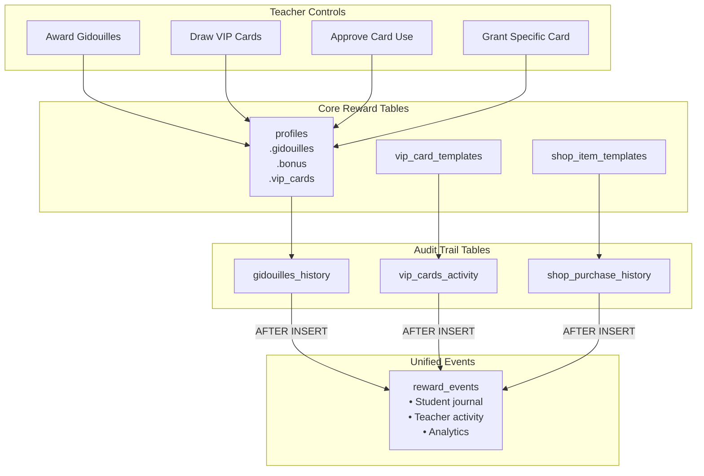

# Rewards System - Technical Reference

> Complete technical documentation for the UbuMaths gamification and rewards system.

## Overview

The UbuMaths rewards system is a comprehensive gamification framework designed to motivate student engagement through multiple interconnected reward mechanisms:

1. **Gidouilles** - Primary virtual currency earned through activities
2. **Bonus Points** - Secondary currency for special achievements
3. **VIP Cards** - Collectible privilege cards with special abilities
4. **Shop Items** - Purchasable consumables, boosters, and cosmetics
5. **Achievements** - Unlockable badges with bonus rewards
6. **Marketplace** - Peer-to-peer trading system between students

## Architecture Diagram



## Key Features

| Feature               | Description                                   |
| --------------------- | --------------------------------------------- |
| **Multi-Currency**    | Gidouilles (primary) + Bonus (secondary)      |
| **Collectibles**      | VIP cards with rarities (common to legendary) |
| **Shop System**       | Purchase items with gidouilles                |
| **P2P Trading**       | Marketplace for student-to-student trades     |
| **Achievements**      | Unlockable badges with gidouille rewards      |
| **Unified Audit**     | All events logged to `reward_events` table    |
| **Teacher Approval**  | VIP card activation requires teacher approval |
| **Weekly Rewards**    | 1 gidouille for no warnings during the week   |
| **Real-time Updates** | Supabase Realtime for instant balance changes |
| **Optimistic UI**     | Instant feedback with debounced server sync   |

## Currency System

### Gidouilles (Primary Currency)

- Stored in `profiles.gidouilles` (INTEGER, CHECK >= 0)
- Earned through: teacher awards, weekly rewards, games, achievements
- Spent on: VIP card draws (3 gidouilles), shop purchases, marketplace trades

### Bonus Points (Secondary Currency)

- Stored in `profiles.bonus` (INTEGER, CHECK >= 0)
- Earned through: teacher awards, special achievements
- Used for: assessment score bonuses

## Documentation Index

| Document                                          | Description                                      |
| ------------------------------------------------- | ------------------------------------------------ |
| [Database Schema](./database-schema.md)           | Complete table definitions and relationships     |
| [API Reference](./api-reference.md)               | REST endpoints for all reward operations         |
| [VIP Cards](./vip-cards.md)                       | Card system, rarities, actions, and activation   |
| [Shop System](./shop-system.md)                   | Item templates, purchasing, and inventory        |
| [Marketplace](./marketplace.md)                   | P2P trading, listings, and negotiations          |
| [Frontend Integration](./frontend-integration.md) | Svelte components, stores, and UI patterns       |
| [Business Logic](./business-logic.md)             | Algorithms, earning rules, and spending policies |
| [Security Model](./security-model.md)             | RLS policies and access control                  |
| [Troubleshooting](./troubleshooting.md)           | Common issues, error codes, and debugging tips   |
| [Testing Guide](./testing.md)                     | How to test rewards system components            |

## Quick Reference

### Type System

```typescript
// Currency types (stored in profiles table)
interface StudentCurrency {
	gidouilles: number; // Primary currency
	bonus: number; // Secondary currency
}

// Reward types (enum in database)
type RewardType = 'gidouilles' | 'bonus' | 'vip_card' | 'achievement' | 'item';

// Event types (enum in database)
type RewardEventType =
	| 'earned' // Gained through activity
	| 'spent' // Used for purchase
	| 'traded' // Exchanged with another player
	| 'used' // Consumed/activated
	| 'expired' // Time-limited item expired
	| 'unlocked' // Achievement unlocked
	| 'purchased' // Bought from shop
	| 'awarded' // Given by teacher/system
	| 'removed'; // Removed by teacher/system

// VIP card rarities
type VipCardRarity = 'common' | 'rare' | 'epic' | 'legendary';

// Shop item categories
type ShopItemCategory = 'consumable' | 'booster' | 'cosmetic' | 'utility';
```

### Key Files

| Category            | Path                                                |
| ------------------- | --------------------------------------------------- |
| **Types**           | `src/lib/types/vip-card.ts`                         |
| **Types**           | `src/lib/types/shop.ts`                             |
| **Types**           | `src/lib/types/reward-journal.ts`                   |
| **API Endpoints**   | `src/routes/api/rewards/`                           |
| **API Endpoints**   | `src/routes/api/teacher/rewards/`                   |
| **API Endpoints**   | `src/routes/api/vip-cards/`                         |
| **API Endpoints**   | `src/routes/api/shop/`                              |
| **Components**      | `src/lib/components/rewards/`                       |
| **Components**      | `src/lib/components/shop/`                          |
| **Teacher Page**    | `src/routes/(protected)/dashboard/teacher/rewards/` |
| **Student Journal** | `src/routes/(protected)/dashboard/student/journal/` |
| **Migrations**      | `supabase/migrations/2025111*_*.sql`                |

### Usage Examples

#### Award Gidouilles (Teacher)

```typescript
// POST /api/teacher/rewards/update-student
const response = await fetch('/api/teacher/rewards/update-student', {
	method: 'POST',
	headers: { 'Content-Type': 'application/json' },
	body: JSON.stringify({
		studentId: 'uuid-here',
		classId: 'uuid-here',
		delta: 10 // +10 gidouilles
	})
});
```

#### Draw VIP Cards

```typescript
// POST /api/rewards/draw-vip-cards
const response = await fetch('/api/rewards/draw-vip-cards', {
	method: 'POST',
	headers: { 'Content-Type': 'application/json' },
	body: JSON.stringify({
		studentId: 'uuid-here',
		count: 1,
		paymentMethod: 'gidouilles',
		gidouillesCost: 3
	})
});
```

#### Query Student Journal

```typescript
// GET /api/rewards/journal
const response = await fetch('/api/rewards/journal?limit=20&reward_type=gidouilles');
const { events, pagination } = await response.json();
```

## Related Documentation

- [Audit Trail System](../audit-trail/README.md) - Detailed audit trail documentation
- [Database Schema Overview](../../architecture/database-schema.md) - Full database schema
- [Security Reference](../security/README.md) - Security best practices
