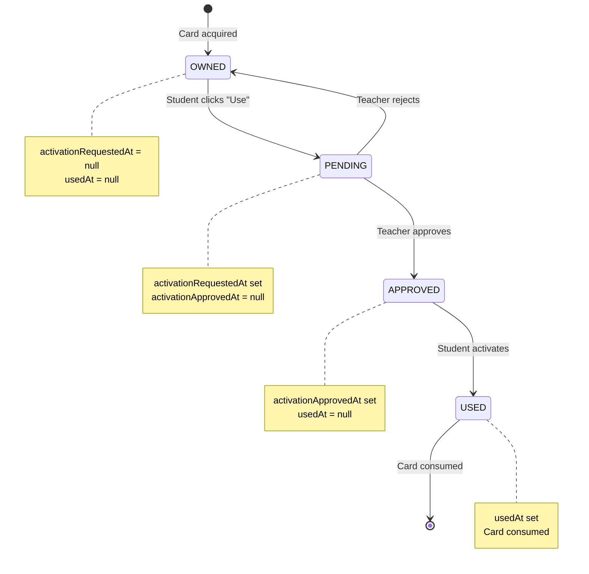

# Business Logic

> Algorithms, earning rules, and spending policies for the rewards system.

## Gidouilles Economy

### Earning Sources

| Source              | Amount        | Frequency      | Description                   |
| ------------------- | ------------- | -------------- | ----------------------------- |
| Teacher Award       | -1000 to 1000 | Manual         | Teacher adds/removes directly |
| Weekly Reward       | 1             | Weekly         | No warnings during the week   |
| Games (Minesweeper) | 1-10          | Per game       | Based on difficulty/time      |
| Achievements        | 1-50          | One-time       | Unlock bonuses                |
| VIP Card Actions    | Variable      | When activated | Cards like Sheikh add 50      |
| Marketplace Trades  | Variable      | Per trade      | P2P exchanges                 |

### Spending Destinations

| Destination        | Cost     | Description          |
| ------------------ | -------- | -------------------- |
| VIP Card Draw      | 3        | Draw one random card |
| Shop Purchases     | 1-100+   | Buy items            |
| Marketplace Trades | Variable | P2P exchanges        |

### Economy Balance Rules

1. **Minimum balance**: 0 gidouilles (CHECK constraint)
2. **Teacher limit**: -1000 to +1000 per action
3. **Large change reason**: Amounts >100 require explanation
4. **Weekly cap**: Teacher-configurable maximum awards

---

## VIP Card Drawing

### Rarity Probability Algorithm

```sql
-- draw_multiple_vip_cards RPC function

-- 1. Get active probability config
SELECT common_probability, rare_probability,
       epic_probability, legendary_probability
INTO v_config
FROM vip_card_config WHERE is_active = TRUE;

-- 2. Generate random number (0-100)
v_random := random() * 100;

-- 3. Determine rarity using cumulative ranges
-- Default: 0-60 common, 60-85 rare, 85-97 epic, 97-100 legendary
IF v_random < v_config.common_probability THEN
    v_rarity := 'common';
ELSIF v_random < v_config.common_probability + v_config.rare_probability THEN
    v_rarity := 'rare';
ELSIF v_random < v_config.common_probability + v_config.rare_probability +
                 v_config.epic_probability THEN
    v_rarity := 'epic';
ELSE
    v_rarity := 'legendary';
END IF;

-- 4. Select random card of that rarity
SELECT id INTO v_card_id
FROM vip_card_templates
WHERE rarity = v_rarity AND is_enabled = TRUE
ORDER BY random()
LIMIT 1;
```

### Expected Distribution (Default Config)

| Draws | Common | Rare | Epic | Legendary |
| ----- | ------ | ---- | ---- | --------- |
| 10    | ~6     | ~2.5 | ~1.2 | ~0.3      |
| 100   | ~60    | ~25  | ~12  | ~3        |

### Draw Payment Methods

**1. Gidouilles Payment:**

```typescript
{
  paymentMethod: 'gidouilles',
  gidouillesCost: 3,  // Per card
  count: 1
}
// Total cost: count * gidouillesCost = 3 gidouilles
```

**2. VIP Card Payment:**

```typescript
{
  paymentMethod: 'vip_card',
  vipCardInstanceId: 'uuid',  // Card with draw_cards action
  count: 3  // Determined by card's action.count
}
// Cost: One VIP card consumed, no gidouilles
```

---

## VIP Card Actions

### Draw Cards Action

```typescript
interface DrawCardsAction {
	type: 'draw_cards';
	count: number;
	filters?: {
		forceRarity?: VipCardRarity; // All cards this rarity
		minRarity?: VipCardRarity; // At least one card this rarity
		excludeCardIds?: string[]; // Exclude specific templates
		onlyCardsWithActions?: boolean; // Only action cards
	};
}
```

**Implementation:**

```sql
-- If forceRarity specified, skip probability calculation
IF filters->>'forceRarity' IS NOT NULL THEN
    v_rarity := filters->>'forceRarity';
END IF;

-- If minRarity specified, guarantee one card
IF filters->>'minRarity' IS NOT NULL AND i = 1 THEN
    v_rarity := ensure_minimum_rarity(filters->>'minRarity');
END IF;
```

### Remove Warnings Action

```typescript
interface RemoveWarningsAction {
	type: 'remove_warnings';
	count: number;
	warningType?: 'C' | 'M' | 'R' | 'T'; // Filter by type
}
```

**Implementation:**

1. Student selects which warnings to remove (up to `count`)
2. UI shows available warnings filtered by `warningType` if specified
3. Selected warnings marked as removed in database
4. Card marked as used

### Exchange Cards Action

**Mode 1: Replace Random**

```typescript
{
  type: 'exchange_cards',
  exchange: {
    mode: 'replace_random',
    count: 5  // Optional fixed count
  }
}
```

- Student discards N cards
- Receives N new random cards
- Original draw probabilities apply

**Mode 2: Rarity Points**

```typescript
{
  type: 'exchange_cards',
  exchange: {
    mode: 'rarity_points',
    targetRarity: 'epic',
    pointsRequired: 9
  }
}
```

Point values:
| Rarity | Points |
| --------- | ------ |
| Common | 1 |
| Rare | 3 |
| Epic | 9 |
| Legendary | 27 |

**Mode 3: Discard for Specific**

```typescript
{
  type: 'exchange_cards',
  exchange: {
    mode: 'discard_for_specific',
    discardCount: 3,
    targetCardId: 'bonus'
  }
}
```

- Discard exactly N cards
- Receive specific card guaranteed

### Add Gidouilles Action

```typescript
interface AddGidouillesAction {
	type: 'add_gidouilles';
	amount: number; // Positive only
}
```

- Gidouilles added to profile
- History logged automatically

### Choose Card Action

```typescript
interface ChooseCardAction {
	type: 'choose_card';
	count: number; // Cards to select
	filter?: 'all'; // All cards available
	maxRarity?: VipCardRarity; // Limit choices
	possibleCardIds?: string[]; // Specific list
}
```

---

## Card Activation Flow

### State Machine



### Approval Requirements

- Teacher must be assigned to student's class
- Card must exist in student's collection
- Card must not already be used
- Card must be in PENDING state for approval

---

## Shop Purchase Logic

### Purchase Validation

```typescript
async function validatePurchase(
	studentId: string,
	templateId: string,
	quantity: number
): Promise<ValidationResult> {
	const template = await getTemplate(templateId);
	const student = await getStudent(studentId);

	// 1. Item availability
	if (!template.is_active) {
		return { valid: false, reason: 'item_not_available' };
	}

	if (template.available_from && new Date() < template.available_from) {
		return { valid: false, reason: 'item_not_yet_available' };
	}

	if (template.available_until && new Date() > template.available_until) {
		return { valid: false, reason: 'item_expired' };
	}

	// 2. Ownership limits
	const owned = await getOwnedCount(studentId, templateId);
	if (template.max_owned_per_student && owned + quantity > template.max_owned_per_student) {
		return { valid: false, reason: 'max_owned_reached' };
	}

	// 3. Purchase frequency
	const dailyCount = await getDailyPurchaseCount(studentId, templateId);
	if (template.daily_purchase_limit && dailyCount + quantity > template.daily_purchase_limit) {
		return { valid: false, reason: 'daily_limit_reached' };
	}

	// 4. Cooldown
	const lastPurchase = await getLastPurchaseTime(studentId, templateId);
	if (template.purchase_cooldown_hours && lastPurchase) {
		const hoursSince = (Date.now() - lastPurchase.getTime()) / 3600000;
		if (hoursSince < template.purchase_cooldown_hours) {
			return { valid: false, reason: 'cooldown_active' };
		}
	}

	// 5. Balance check
	const finalPrice = calculateFinalPrice(template);
	const totalCost = finalPrice * quantity;
	if (student.gidouilles < totalCost) {
		return { valid: false, reason: 'insufficient_gidouilles' };
	}

	return { valid: true, cost: totalCost };
}
```

### Price Calculation

```typescript
function calculateFinalPrice(template: ShopItemTemplate): number {
	const basePrice = template.base_price;
	const discount = template.discount_percentage ?? 0;
	return Math.ceil((basePrice * (100 - discount)) / 100);
}
```

---

## Weekly Rewards

### Eligibility Check

```sql
-- Check if student had warnings during the week
SELECT COUNT(*) = 0 as eligible
FROM warnings
WHERE student_id = $1
  AND class_id = $2
  AND created_at >= $week_start
  AND created_at < $week_end;
```

### Award Process

```sql
-- Run weekly (e.g., Sunday night)
INSERT INTO weekly_rewards (student_id, class_id, week_start, week_end)
SELECT
    cm.student_id,
    cm.class_id,
    $week_start,
    $week_end
FROM class_members cm
WHERE cm.status = 'active'
  AND NOT EXISTS (
      SELECT 1 FROM warnings w
      WHERE w.student_id = cm.student_id
        AND w.class_id = cm.class_id
        AND w.created_at >= $week_start
  );

-- Gidouilles updated via RPC trigger
```

---

## Debounced Updates

### Pattern

```typescript
const DEBOUNCE_MS = 500;
const pendingDeltas = new Map<string, number>();
const timers = new Map<string, NodeJS.Timeout>();

function queueUpdate(studentId: string, delta: number) {
	// Accumulate delta
	const current = pendingDeltas.get(studentId) ?? 0;
	pendingDeltas.set(studentId, current + delta);

	// Clear existing timer
	const existing = timers.get(studentId);
	if (existing) clearTimeout(existing);

	// Set new timer
	timers.set(
		studentId,
		setTimeout(() => {
			syncToServer(studentId);
		}, DEBOUNCE_MS)
	);
}

async function syncToServer(studentId: string) {
	const delta = pendingDeltas.get(studentId);
	if (!delta) return;

	pendingDeltas.delete(studentId);

	await fetch('/api/teacher/rewards/update-student', {
		method: 'POST',
		body: JSON.stringify({ studentId, delta })
	});
}
```

### Benefits

1. **Reduced API calls**: Multiple rapid clicks = single request
2. **Better UX**: Instant feedback via optimistic update
3. **Network efficiency**: Accumulated changes sent together

---

## Audit Trail Generation

### Trigger-based Auto-logging

```sql
-- AFTER INSERT on gidouilles_history
CREATE TRIGGER trigger_log_gidouilles_to_events
AFTER INSERT ON gidouilles_history
FOR EACH ROW
EXECUTE FUNCTION log_gidouilles_history_to_events();
```

### Event Type Mapping

| Source Table          | Condition          | Event Type |
| --------------------- | ------------------ | ---------- |
| gidouilles_history    | delta > 0          | earned     |
| gidouilles_history    | delta < 0          | spent      |
| bonus_history         | delta > 0          | earned     |
| bonus_history         | delta < 0          | used       |
| vip_cards_activity    | action = 'gained'  | earned     |
| vip_cards_activity    | action = 'used'    | used       |
| vip_cards_activity    | action = 'removed' | removed    |
| student_achievements  | any                | unlocked   |
| shop_purchase_history | any                | purchased  |
| item_usage_log        | any                | used       |
| marketplace_trades    | completed          | traded     |

### Description Generation

```sql
CREATE FUNCTION generate_reward_event_description(
    p_reward_type reward_type,
    p_event_type reward_event_type,
    p_amount INTEGER,
    p_item_name TEXT,
    p_metadata JSONB
) RETURNS TEXT;

-- Examples:
-- 'Gagne 10 gidouilles : devoir bien fait'
-- 'Depense 3 gidouilles pour Carte VIP'
-- 'Carte VIP obtenue : Bonus'
-- 'Succes debloque : Premier pas (+5 gidouilles)'
```
