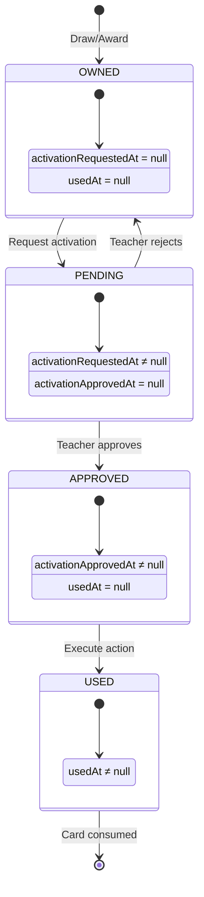
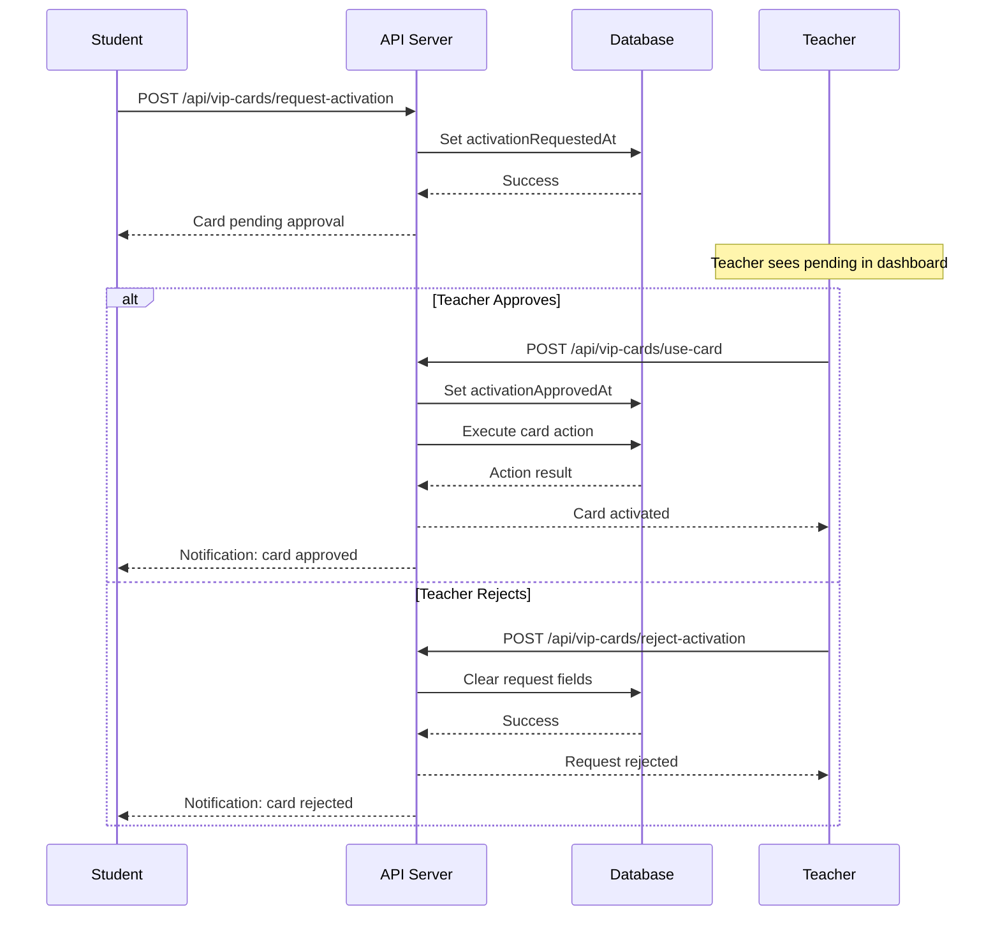

# VIP Cards System

> Complete documentation for the VIP card collectible system.

## Overview

VIP cards are collectible privilege cards that students can earn and use for special benefits. The system features:

- **26 unique cards** across 4 rarity tiers
- **Weighted random draws** with configurable probabilities
- **Teacher approval workflow** for card activation
- **Special abilities** (draw more cards, remove warnings, etc.)
- **Trading support** via the marketplace

## Card Rarities

| Rarity    | Probability | Card Color | Total Cards | Active |
| --------- | ----------- | ---------- | ----------- | ------ |
| Common    | 60%         | Gray       | 8           | 6      |
| Rare      | 25%         | Blue       | 10          | 9      |
| Epic      | 12%         | Purple     | 6           | 6      |
| Legendary | 3%          | Gold       | 2           | 2      |

**Note:** Some cards are disabled (not drawable) but remain in the system.

## Card Categories

| Category    | Description                         | Examples                  |
| ----------- | ----------------------------------- | ------------------------- |
| `bonus`     | Academic bonuses and rewards        | Bonus (+1), Super Bonus   |
| `privilege` | Classroom privileges                | Choix de Place, Bougeotte |
| `social`    | Team and social benefits            | Voltaire's got talent     |
| `power`     | Special abilities and game-changers | Help!, Ecrabouilleur      |

## Complete Card List

### Common Cards (6 active)

| ID             | Name           | Description                       | Action          |
| -------------- | -------------- | --------------------------------- | --------------- |
| `bonus`        | Bonus          | +1 sur un devoir au choix         | -               |
| `choix`        | Choix de Place | Choisis ta place pour une semaine | -               |
| `bougeotte`    | Bougeotte      | Choisis ta place pour un cours    | -               |
| `jeu`          | Jeu            | Choisis le jeu mathematique       | -               |
| `soldes`       | Soldes         | Pioche 2 nouvelles cartes VIP     | `draw_cards: 2` |
| `super-soldes` | Super Soldes   | Pioche 3 nouvelles cartes VIP     | `draw_cards: 3` |

**Disabled:** `candy`, `captain`

### Rare Cards (9 active)

| ID                | Name            | Description                          | Action               |
| ----------------- | --------------- | ------------------------------------ | -------------------- |
| `super-bonus`     | Super Bonus     | +2 sur un devoir au choix            | -                    |
| `coup-double`     | Coup Double     | Evaluation compte 2x dans la moyenne | -                    |
| `super-bougeotte` | Super Bougeotte | Place pendant une semaine            | -                    |
| `tranquilou`      | Tranquilou      | Excuse pour oubli de devoirs         | -                    |
| `lalalalala`      | Lalalalala      | Choisis une chanson                  | -                    |
| `help`            | Help !          | Aide du prof pendant l'evaluation    | -                    |
| `mathemagie`      | Mathemagie      | Assistant de Daoudini                | -                    |
| `ecrabouilleur`   | Ecrabouilleur   | Enleve un avertissement              | `remove_warnings: 1` |
| `inventeur`       | Inventeur       | Propose une nouvelle carte           | -                    |
| `mega-soldes`     | Mega Soldes     | Pioche 4 nouvelles cartes VIP        | `draw_cards: 4`      |

**Disabled:** `team`

### Epic Cards (6 active)

| ID           | Name                  | Description                       | Action           |
| ------------ | --------------------- | --------------------------------- | ---------------- |
| `mega-bonus` | Mega Bonus            | +3 points sur un devoir           | -                |
| `throne`     | Game of Throne        | Prends le fauteuil du prof        | -                |
| `fame`       | Voltaire's got talent | C'est ton heure de gloire         | -                |
| `memoire`    | Trou de memoire       | Utilise tes cahiers en evaluation | -                |
| `alchimie`   | Alchimie              | Transforme 3 cartes en Bonus      | `exchange_cards` |
| `batman`     | Batman and Robin      | Super-assistant du prof           | -                |

### Legendary Cards (2 active)

| ID        | Name               | Description                       | Action               |
| --------- | ------------------ | --------------------------------- | -------------------- |
| `fortune` | Roue de la Fortune | Remplace tes cartes par nouvelles | `exchange_cards`     |
| `Sheikh`  | Sheikh - Sheikha   | Fauteuil du prof + 50 gidouilles  | `add_gidouilles: 50` |

---

## Card Actions

Cards with the `action` property have special abilities that execute when activated.

### Action Types

```typescript
type VipCardAction =
	| DrawCardsAction
	| RemoveWarningsAction
	| ExchangeCardsAction
	| AddGidouillesAction
	| ChooseCardAction;
```

### Draw Cards

Awards random VIP cards to the student (no gidouilles cost).

```json
{
	"type": "draw_cards",
	"count": 2,
	"filters": {
		"forceRarity": "rare", // Optional: force specific rarity
		"minRarity": "rare", // Optional: guarantee minimum rarity
		"excludeCardIds": ["bonus"], // Optional: exclude specific cards
		"onlyCardsWithActions": true // Optional: only action cards
	}
}
```

**Examples:**

- Soldes: `{ "type": "draw_cards", "count": 2 }`
- Super Soldes: `{ "type": "draw_cards", "count": 3 }`
- Mega Soldes: `{ "type": "draw_cards", "count": 4 }`

### Remove Warnings

Removes warnings from the student's record.

```json
{
	"type": "remove_warnings",
	"count": 1,
	"warningType": "C" // Optional: specific type (C, M, R, T)
}
```

**Example:** Ecrabouilleur: `{ "type": "remove_warnings", "count": 1 }`

### Exchange Cards

Three modes for trading cards:

**Mode 1: Replace Random**

```json
{
	"type": "exchange_cards",
	"exchange": {
		"mode": "replace_random",
		"count": 5 // Optional: fixed count, or user chooses 1-10
	}
}
```

**Mode 2: Rarity Points**

```json
{
	"type": "exchange_cards",
	"exchange": {
		"mode": "rarity_points",
		"targetRarity": "epic",
		"pointsRequired": 9
	}
}
```

Point values: common=1, rare=3, epic=9, legendary=27

**Mode 3: Discard for Specific**

```json
{
	"type": "exchange_cards",
	"exchange": {
		"mode": "discard_for_specific",
		"discardCount": 3,
		"targetCardId": "bonus"
	}
}
```

**Examples:**

- Roue de la Fortune: Replace all cards randomly
- Alchimie: Trade 3 cards for a Bonus card

### Add Gidouilles

Awards gidouilles to the student.

```json
{
	"type": "add_gidouilles",
	"amount": 50
}
```

**Example:** Sheikh - Sheikha: `{ "type": "add_gidouilles", "amount": 50 }`

### Choose Card

Student selects specific cards to receive.

```json
{
	"type": "choose_card",
	"count": 1,
	"maxRarity": "epic", // Mode 2: limit by rarity
	"possibleCardIds": ["bonus"] // Mode 3: specific list
}
```

---

## Card Instance Lifecycle

### State Flow



### Instance Structure

Each card instance is stored in `profiles.vip_cards` JSONB:

```typescript
interface VipCardInstance {
	cardId: string; // Template ID (e.g., "bonus")
	earnedAt: string; // ISO timestamp
	usedAt: string | null; // When consumed
	activationRequestedAt?: string; // When student requested
	activationRequestedBy?: string; // Student UUID
	activationApprovedAt?: string; // When teacher approved
	activationApprovedBy?: string; // Teacher UUID
}

// Storage format
type StudentVipCards = Record<string, VipCardInstance>;
// Key: UUID (instance ID), Value: VipCardInstance
```

### Activation Flow



---

## Drawing Cards

### Cost

Default: **3 gidouilles** per card draw

### Probability Calculation

```sql
-- In draw_multiple_vip_cards RPC function
SELECT INTO v_config
  common_probability,
  rare_probability,
  epic_probability,
  legendary_probability
FROM vip_card_config
WHERE is_active = TRUE;

-- Random selection
v_random := random() * 100;

IF v_random < v_config.common_probability THEN
    v_rarity := 'common';
ELSIF v_random < v_config.common_probability + v_config.rare_probability THEN
    v_rarity := 'rare';
ELSIF v_random < v_config.common_probability + v_config.rare_probability + v_config.epic_probability THEN
    v_rarity := 'epic';
ELSE
    v_rarity := 'legendary';
END IF;

-- Select random enabled card of that rarity
SELECT id INTO v_card_id
FROM vip_card_templates
WHERE rarity = v_rarity AND is_enabled = TRUE
ORDER BY random()
LIMIT 1;
```

### Configuration System

Probability distributions can be customized:

```sql
-- Default config
INSERT INTO vip_card_config (
  config_name, common_probability, rare_probability,
  epic_probability, legendary_probability, is_active
) VALUES ('default', 60, 25, 12, 3, TRUE);

-- Event config (e.g., Halloween with better odds)
INSERT INTO vip_card_config (
  config_name, common_probability, rare_probability,
  epic_probability, legendary_probability, is_active
) VALUES ('halloween', 50, 30, 15, 5, FALSE);
```

**Constraint:** Probabilities must sum to exactly 100.

---

## Teacher Overrides

Teachers can override VIP card availability for their classes:

```sql
-- vip_card_teacher_overrides table
CREATE TABLE vip_card_teacher_overrides (
  id UUID PRIMARY KEY,
  teacher_id UUID REFERENCES profiles(id),
  class_id UUID REFERENCES classes(id),
  card_id TEXT REFERENCES vip_card_templates(id),
  is_enabled BOOLEAN NOT NULL,  -- Override global is_enabled
  created_at TIMESTAMPTZ
);
```

This allows teachers to:

- Enable disabled cards for their class
- Disable certain cards for their class

---

## Activity Logging

All card transactions are logged to `vip_cards_activity`:

```sql
-- Actions logged
'gained'  -- Card obtained (draw, award, trade)
'used'    -- Card activated and consumed
'removed' -- Card removed by teacher/system
```

These events automatically populate `reward_events` via database triggers.

---

## Frontend Components

| Component                 | Path                          | Purpose                 |
| ------------------------- | ----------------------------- | ----------------------- |
| `VipCardDrawModal.svelte` | `src/lib/components/rewards/` | Card draw animation     |
| `VipCardsModal.svelte`    | `src/lib/components/`         | View card collection    |
| `VipCardSelector.svelte`  | `src/lib/components/`         | Card selection dropdown |
| `VipCardImage.svelte`     | `src/lib/components/`         | Single card display     |

---

## Security

### RLS Policies

```sql
-- vip_card_templates: All authenticated users can view
-- vip_card_config: Only active config visible to users, admins see all
-- vip_cards (in profiles): Only owner can see their cards
-- vip_cards_activity: Students see own, teachers see class
```

### Validation

- Card instance IDs validated as UUIDs
- Card template IDs validated against database
- Ownership verified before activation
- Teacher-student relationship verified for approval

---

## API Quick Reference

| Endpoint                                       | Method | Description                                    |
| ---------------------------------------------- | ------ | ---------------------------------------------- |
| `/api/rewards/draw-vip-cards`                  | POST   | Draw cards (pay gidouilles or use action card) |
| `/api/vip-cards/request-activation`            | POST   | Student requests activation                    |
| `/api/vip-cards/use-card`                      | POST   | Teacher approves activation                    |
| `/api/vip-cards/reject-activation`             | POST   | Teacher rejects activation                     |
| `/api/vip-cards/choose`                        | POST   | Execute choose card action                     |
| `/api/vip-cards/exchange`                      | POST   | Execute exchange card action                   |
| `/api/teacher/rewards/award-vip-card`          | POST   | Teacher awards random card                     |
| `/api/teacher/rewards/grant-specific-vip-card` | POST   | Teacher grants specific card                   |
| `/api/teacher/rewards/remove-vip-card`         | POST   | Teacher removes card                           |
